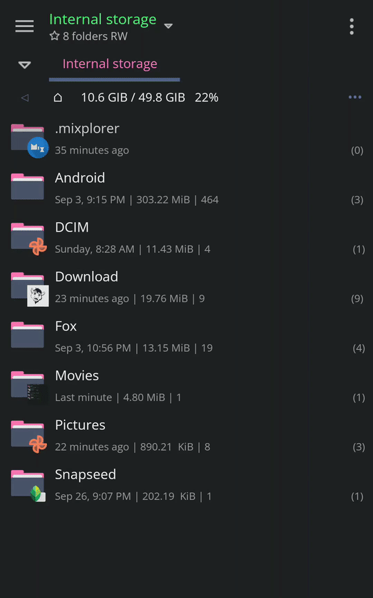

### [MiXplorer](https://mixplorer.com/)

#### Install manually

Download the `dracula-mixplorer.mit` file, from the latest [release](https://github.com/dracula/mixplorer/releases)

#### Activating theme

Open MiXplorer, select the file `dracula-mixplorer.mit` then select `Import`

#### Troubleshooting

If the theme is not applying properly, follow this method [here](https://github.com/dracula/mixplorer/wiki/Troubleshooting#fixtheme)

<!-- 

    
If the theme is not applying properly, follow this method

    

 -->
