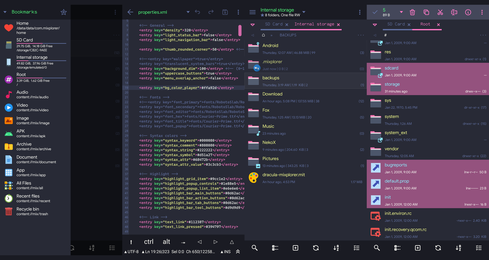

# Dracula for [MiXplorer](https://mixplorer.com/)

> A dark theme for [MiXplorer](https://mixplorer.com/).

## Install

All instructions can be found at [draculatheme.com/mixplorer](https://draculatheme.com/mixplorer).
## Team

This theme is maintained by the following person(s) and a bunch of [awesome contributors](https://github.com/dracula/template/graphs/contributors).

 | 
--- | ---
[Kyla Uyara](https://github.com/nesl247) | [Zeno Rocha](https://github.com/zenorocha)

## License

[MIT License](./LICENSE)
